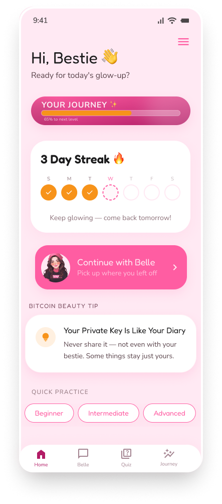
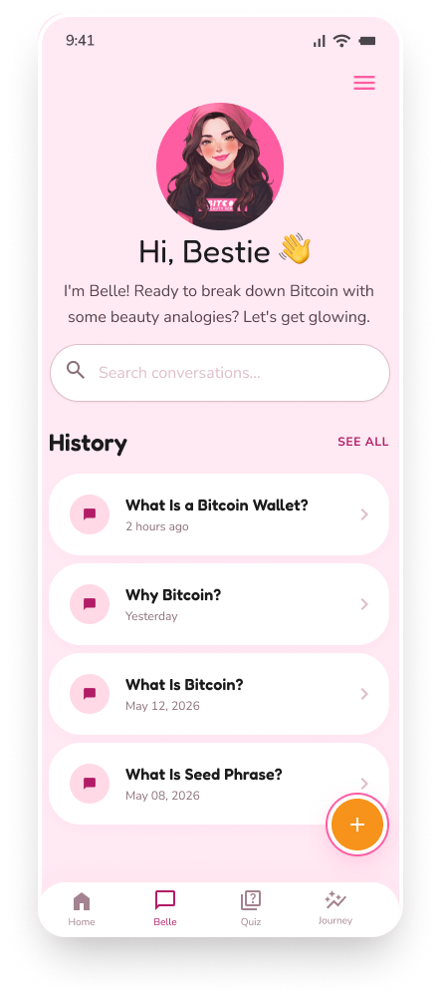
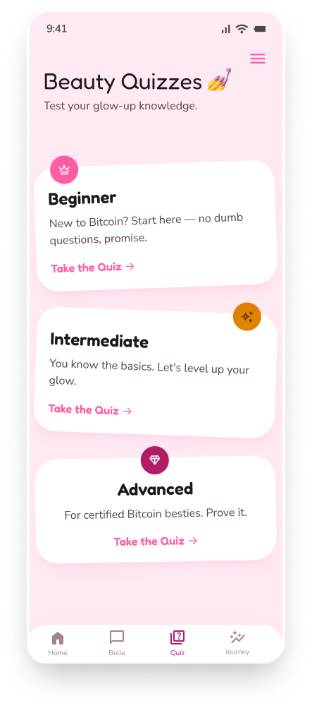

# Bitcoin Beauty School 💅₿

**Learn Bitcoin like beauty products — with gloss, grace & good vibes.**

A mobile app concept that teaches Bitcoin fundamentals through beauty analogies, designed for total beginners who find crypto intimidating — with a special focus on making the space more welcoming to women.

## The Idea

Bitcoin education is often gatekept by jargon. Terms like "private key," "seed phrase," or "cold wallet" can feel intimidating to newcomers — especially to an audience that rarely sees itself represented in the space.

**Bitcoin Beauty School** flips that. Every core Bitcoin concept is taught through a beauty-world analogy: a wallet becomes a makeup organizer, a blockchain becomes a transparent, tamper-proof makeup bag, a seed phrase becomes a custom lipstick-mixing machine that can recreate anything you've made. No dumbing down — just a different, more familiar language for the same real concepts.

At the center of the experience is **Belle**, an AI companion who teaches Bitcoin the way a best friend would: casual, encouraging, and always in on-brand analogies.

## Design Process

This project didn't start with screens — it started with the user.

1. **User journey mapping** — before any UI work, I mapped out the full journey of a Bitcoin beginner: where the confusion starts, what causes drop-off, and where an app like this could actually reduce friction instead of adding to it.
2. **Pain points research** — identified the specific moments that make Bitcoin apps feel unwelcoming (jargon-heavy onboarding, generic security warnings, no sense of personality or trust).
3. **Design system** — built a full visual identity in Figma: color palette, typography (Fredoka + Nunito Sans), a recurring "coin halo" motif, and a component library (buttons, inputs, cards) before touching a single screen.
4. **Screen design** — 18 screens designed end-to-end in Figma, covering onboarding, authentication, the AI chat experience, quizzes, and progress tracking.
5. **Development (in progress)** — now moving into building the app for real, in **Flutter**.

One deliberate design decision worth calling out: instead of a traditional email/password login, the app uses a **key phrase** system — a short, beauty-themed phrase generated on first use, inspired by how Bitcoin wallets handle seed phrases. It reflects Bitcoin's own privacy philosophy: no accounts, no personal data tied to your identity, just a phrase only you know.

## Tech Stack (planned)

- **Flutter** — cross-platform app development
- **Belle AI** — conversational AI integration for the in-app learning companion
- **Nostr** — the key phrase deterministically derives a Nostr keypair (same idea as a BIP-39 seed deriving Bitcoin keys), and that keypair is the account: no servers, no traditional login, progress and chat history sync as encrypted Nostr events instead of rows in a database

### A design note: why "Belle" isn't really a second party

Belle's chat history is stored using NIP-17 (Nostr's private direct message standard), which is built for two independent people who each keep their own private key secret. Belle isn't an independent person on the network — she's a persona inside the app with no server-side identity of her own. That's a real mismatch, and the easy fix (give the app one hardcoded "Belle" keypair, shared across every install) would be a privacy bug wearing a feature's clothes: that private key would ship inside the app binary on every device, so it wouldn't actually be private, and the "encrypted" conversation would be readable by anyone who bothered to extract it.

The fix: Belle's keypair is derived from the *same* key phrase as the user's own identity, just with a different derivation tag — the same one-way process, just two different labels going in. Nothing is shared across installs and nothing is hardcoded. The honest way to describe what this buys you: it's not a conversation with an independent Belle identity, it's the user's own client having a structured conversation with itself, wrapped in NIP-17's envelope for its metadata-privacy properties. Anyone who has the key phrase can derive both keys and read both sides — which is exactly the same person in every real scenario, since having the phrase already means having the whole account.

### A design note: why Belle is scripted, not a live LLM

Belle answers from a fully offline, keyword-matched response system (`lib/services/belle_response_matcher.dart`, matched against [`content/belle/belle_scripted_responses.json`](./content/belle/belle_scripted_responses.json)) — 15 Bitcoin topics across all three quiz tiers, each with its own keyword list and a hand-written response in Belle's voice, plus 4 fallback responses (no match, a financial-advice-seeking question, an altcoin question, a detected quiz question). No network call, no API key, nothing to configure or rate-limit, and zero ongoing cost — the trade-off is that Belle can only discuss what she's been scripted for, rather than reasoning freely.

This is a reversal of the original plan: Belle was first designed to call a real LLM (Claude) through a backend proxy, with [`content/belle/system_prompt.md`](./content/belle/system_prompt.md) and [`content/belle/knowledge_base.md`](./content/belle/knowledge_base.md) as her persona and ground-truth reference. Both files stay in the repo — they're what the scripted responses were actually written from (same voice, same analogies, same guardrails like "no financial advice" and "Bitcoin-only"), so they're worth keeping as documentation even though nothing sends them to an LLM anymore. Neither file is registered as a Flutter asset or ships in the app binary; only `belle_scripted_responses.json` does, since it's the one file the app actually reads on-device.

The backend proxy itself ([`backend/belle-proxy`](./backend/belle-proxy) — a Cloudflare Worker that would've held the Anthropic API key server-side) was fully built, unit-tested, and verified locally before this direction changed. It's shelved, not deleted — not deployed, and the app doesn't call it — in case a live LLM is worth revisiting later. See [`backend/belle-proxy/README.md`](./backend/belle-proxy/README.md) for the full "not currently in use" note and the original platform-choice reasoning.

**Heads-up for later:** `knowledge_base.md` is already ~40KB (quiz-tier content plus all 6 planned "technical deep dive" passes). That's manageable as a single system-context block today, but it's worth watching — if it keeps growing, a future backend pass may need to send only the relevant section per conversation (e.g. by topic or quiz tier) rather than the whole file on every request, to stay comfortably inside the LLM's context window and keep prompt costs down. Not a problem yet, just flagging it before it becomes one.

## Design

Full design system and screens are available in Figma:
**[View on Figma →](https://www.figma.com/design/8s38gKBjlSFw2vvFAToxmW/bitcoin-beauty-school--c%C3%B3pia-?node-id=1-2&t=Yn9LVZyBMbgtI4KK-1)**

### Brand

  
  

### Screens

A selection of the 18 screens designed for this project — from onboarding to the Belle AI chat, quizzes, and progress tracking.

  
  
  
  
  
  
  
  

*See the [`/design`](./design) folder for the complete set.*

## Status

- [x] User journey mapping & pain point research
- [x] Design system (Figma)
- [x] 18 screens designed
- [ ] Flutter development
- [ ] Belle AI integration
- [ ] Beta release

## About

Designed and built by **Tricia Linewberg** — UX/UI & Product Designer.

[LinkedIn](https://www.linkedin.com/in/tricia-linewberg/)
